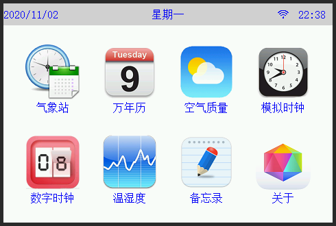

### 设备界面

---

下边是设备界面展示，具体以收到的实物为准  

`程序随时可能会升级，界面会稍有变化，具体以实物为准`

### 语音播报素材

---

 - 甜美语音包<a href="images/voice.rar" target="_blank">下载链接</a>
 - 语音更新工具<a href="images/语音合成工具.rar" target="_blank">下载链接</a>

`以上素材来源于网络，如果大家有更好有素材，可以发送到xfdr0805@126.com 邮箱，测试OK我会更新到设备里`

### 设备外观

---

`外壳为3D打印，材料为树脂或PLA，由于是3D打印，所以无法与使用模具做出来的产品相比较，难免会有瑕疵`

### 设备尺寸

---

 - PCB尺寸

 - 外壳尺寸

 - 3D打印文件<a href="images/3D打印文件.rar" target="_blank">下载链接</a>
